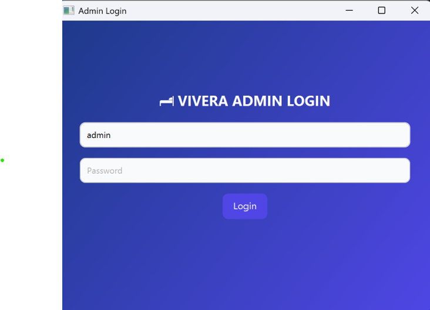
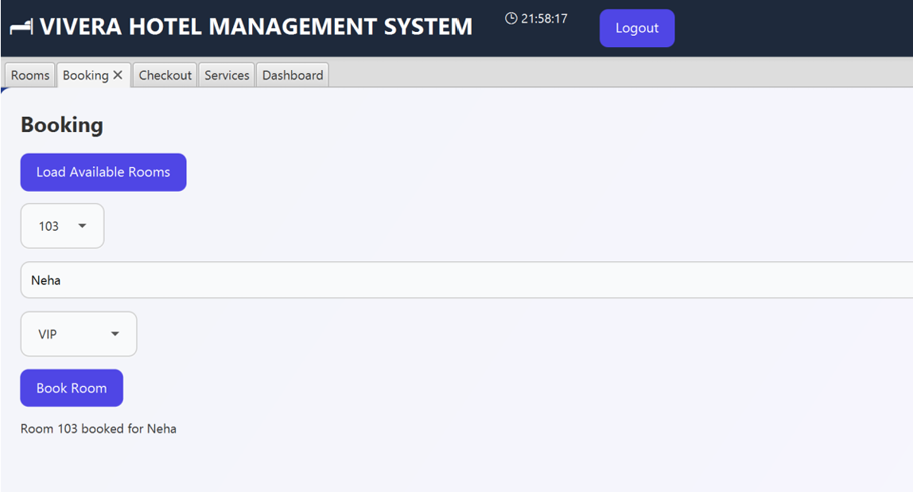
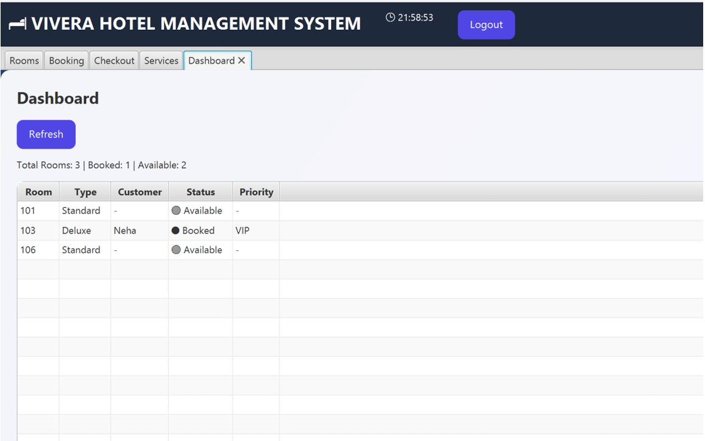

# Hotel Management System (JavaFX)

A desktop-based hotel management application developed using JavaFX for managing hotel operations including room allocation, booking workflows, and occupancy tracking.

The system provides a graphical interface to manage room availability, customer bookings, and hotel dashboard statistics.

---

## Features

- Admin login system
- Room management
- Room booking workflow
- Checkout handling
- Room availability tracking
- Dashboard with occupancy overview
- Deluxe and Standard room categorization

---

## Tech Stack

- Java
- JavaFX

---

## Project Structure

```text
hotel-management-system-javafx/
│
├── src/
│   ├── core/
│   │   ├── BookingManager.java
│   │   └── FileManager.java
│   │
│   ├── rooms/
│   │   ├── Room.java
│   │   ├── StandardRoom.java
│   │   └── DeluxeRoom.java
│   │
│   └── MainApp.java
│
├── assets/
│   └── screenshots/
│       ├── login.png
│       ├── booking.png
│       └── dashboard.png
│
├── README.md

```

---

## Screenshots

### Admin Login



---

### Booking System



---

### Dashboard



---

## Modules

### Room Management
Manage room details and room categories.

### Booking
Allocate available rooms and track booking status.

### Dashboard
Monitor room occupancy and booking information.

---


## Challenges Faced

- managing UI state across modules
- synchronizing booking updates
- handling room availability tracking
- organizing reusable JavaFX components

---

## Learning Outcomes

This project strengthened my understanding of:

- JavaFX GUI development
- object-oriented programming
- desktop application workflows
- modular Java application structure
